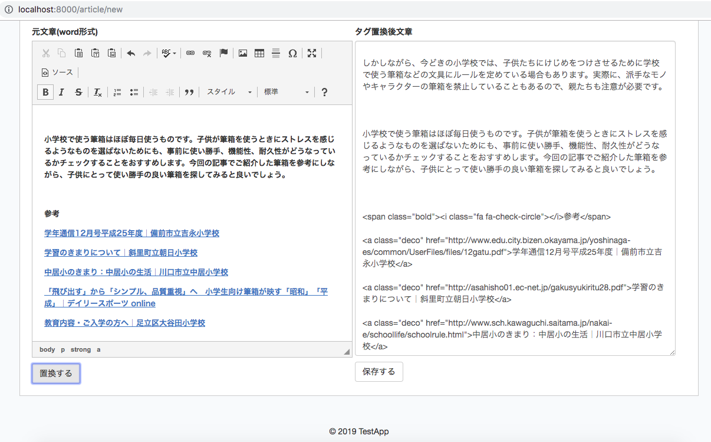

## URL
https://wpapp0519.herokuapp.com/

## 内容
WordPressで運営しているWebメディアに、Googleドキュメントで書いた原稿を入稿する際に、
不要なタグの削除やclassの追加などの置換を一気に行うことができる。


### 置換例（JQueryで正規表現を利用)
```
&nbsp;を削除
```

```
<a href="">link</a>
↓ class="deco"を追加
<a class="deco" href="">link</a>
```

## 開発環境
- PHP 7.1.16
- Laravel 5.8.17
- PostgreSQL  11.3
